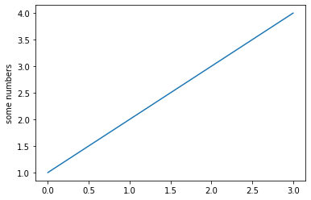

## Background

As part of my undergraduate studies I recently had to write a formal report on the exciting
topic of mechanical resonance after having collected data from the transient and
steady state responses of a oscillating torsional pendulum.

Rather problematically, we have yet to be taught any meaningful data processing outside of basic Excel regression,
which proved a bit of a hindrance in establishing the quality factor of the oscillator.


Supposedly this could be done by taking the ratio of the amplitude at resonance and the amplitude
for an angular frequency of 0 radians per second. The amplitude at resonance would then have to be
guestimated from the graph in Figure 1.
That’s hardly very scientific and in my case introduced such large errors that
the estimated quality factor was effectively useless with an uncertainty north of 20%.

## A better way
A better way of going about this would be to establish the resonant frequency $ω_0$
and the damping coefficient $γ$ by fitting the data to the following model:

$$
X(ω) = \frac{f}{\sqrt{\qty(ω^2_0 - ω^2)^2} + 4γ^2 ω^2}
$$
<figcaption>Equation 1: Amplitude as a function of angular frequency</figcaption>

The quality factor could then be found without resorting to questionable approximations by using the definition of the quality factor:

$$
Q = \frac{ω_0}{2γ}
$$
<figcaption>Equation 2: Definition of quality factor</figcaption>

Performing a custom regression analysis is however not a trivial task given the set of tools made available to a first year Natural Sciences student in the UK.

## Python to the rescue
Luckily Python is an excellent language for all things science and a range of packages give easy access to powerful data analysis tools.

In order to perform the custom fit I used the following Python packages:

- lmfit
- numpy
- pandas
- sympy
- matplotlib
- uncertainties

## Getting the Excel data into pandas

The first challenge is to get the data from the [Excel file](https://github.com/JeppeKlitgaard/E5-mechanical-resonance/blob/master/E5data.xlsx?raw=true) into a `pandas.DataFrame`. This is code rather crudely by using the `pandas.read_excel` function and simply selecting the data for the two different degrees of damping examined.

$$
a = b
$$
<figcaption>Equation 1: $a$ is the same as $b$</figcaption>


    Hidden input!


    

    


```python
print("Hidden output")
```

    Hidden output


Figure 2
Which outputs the DataFrame shown in Figure 2.

Defining a function to fit to
Now we need to use lmfit to define a Model to which we can fit the data. This is done by defining a function corresponding to Equation 2.

If we try to fit the function to the data straight away we run into problems — we need to provide a reasonable initial guess of the different parameters. This could probably be done by simple intelligent guess-work, but we could also solve 3 equations with 3 unknowns using the sympy package and by defining meaningful bounds for our parameters.

Performing the fit
We are now ready to perform the fit. We need to do it twice — once for each degree of damping (I_braking = 0.3A and I_braking = 0.6A ). We store the results of our regression analysis in the a dict called results

Plotting the data and fit
Finally we are ready to plot the data and accompanying fits using matplotlib. This is fairly straight forward for anyone used to matplotlib or MATLAB. By using lmfit we get easy access to the standard errors, which we can find by doing ModelResult.eval_uncertainty(). We can also calculate the R² value from the residuals from the fit.

ufloat from the uncertainties package is used to easily propagate the standard errors from the ω₀ and γ estimates onto the quality factor estimate (see Equation 2).

The result
matplotlib gives us this lovely figure as a reward for our hard work.

Figure 3: Data with fit
Conclusion
Using the method suggested by the Lab Manual I got a quality factor value of Q = 5.6 with standard error of 1.2. By fitting the data to the theoretical model we instead get a value of Q = 5.57 with a standard error of 0.15, from which actual conclusions can be drawn.

I am assured University of Cambridge will join the 21st century any day now, but until then we will continue to perform non-linear best-fits by hand and creative imagination.

The Jupyter notebook containing the code can be found on my GitHub along with the raw Excel file: https://github.com/dkkline/E5-mechanical-resonance

Supposedly this could be done by taking the ratio of the amplitude at resonance and the amplitude for an angular frequency of 0 radians per second. The amplitude at resonance would then have to be guestimated from the graph in Figure 1. That’s hardly very scientific and in my case introduced such large errors that the estimated quality factor was effectively useless with an uncertainty north of 20%.

A better way
A better way of going about this would be to establish the resonant frequency ω₀ and the damping coefficient γ by fitting the data to the following model:

Equation 1: Amplitude as a function of angular frequency
The quality factor could then be found without resorting to questionable approximations by using the definition of the quality factor:

Equation 2: Definition of quality factor
Performing a custom regression analysis is however not a trivial task given the set of tools made available to a first year Natural Sciences student in the UK.

Python to the rescue
Luckily Python is an excellent language for all things science and a range of packages give easy access to powerful data analysis tools.

In order to perform the custom fit I used the following Python packages:

lmfit
numpy
pandas
sympy
matplotlib
uncertainties
Getting the Excel data into pandas
The first challenge is to get the data from the Excel file into a pandas.DataFrame. This is code rather crudely by using the pandas.read_excel function and simply selecting the data for the two different degrees of damping examined.

Figure 2
Which outputs the DataFrame shown in Figure 2.

Defining a function to fit to
Now we need to use lmfit to define a Model to which we can fit the data. This is done by defining a function corresponding to Equation 2.

If we try to fit the function to the data straight away we run into problems — we need to provide a reasonable initial guess of the different parameters. This could probably be done by simple intelligent guess-work, but we could also solve 3 equations with 3 unknowns using the sympy package and by defining meaningful bounds for our parameters.

Performing the fit
We are now ready to perform the fit. We need to do it twice — once for each degree of damping (I_braking = 0.3A and I_braking = 0.6A ). We store the results of our regression analysis in the a dict called results

Plotting the data and fit
Finally we are ready to plot the data and accompanying fits using matplotlib. This is fairly straight forward for anyone used to matplotlib or MATLAB. By using lmfit we get easy access to the standard errors, which we can find by doing ModelResult.eval_uncertainty(). We can also calculate the R² value from the residuals from the fit.

ufloat from the uncertainties package is used to easily propagate the standard errors from the ω₀ and γ estimates onto the quality factor estimate (see Equation 2).

The result
matplotlib gives us this lovely figure as a reward for our hard work.

Figure 3: Data with fit
Conclusion
Using the method suggested by the Lab Manual I got a quality factor value of Q = 5.6 with standard error of 1.2. By fitting the data to the theoretical model we instead get a value of Q = 5.57 with a standard error of 0.15, from which actual conclusions can be drawn.

I am assured University of Cambridge will join the 21st century any day now, but until then we will continue to perform non-linear best-fits by hand and creative imagination.

The Jupyter notebook containing the code can be found on my GitHub along with the raw Excel file: https://github.com/dkkline/E5-mechanical-resonance

asd ... [link](https://google.com)
